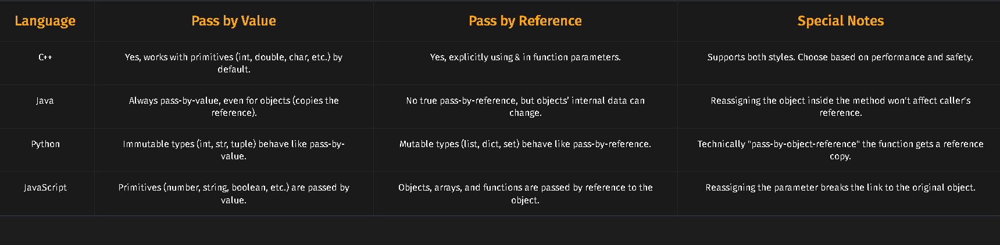
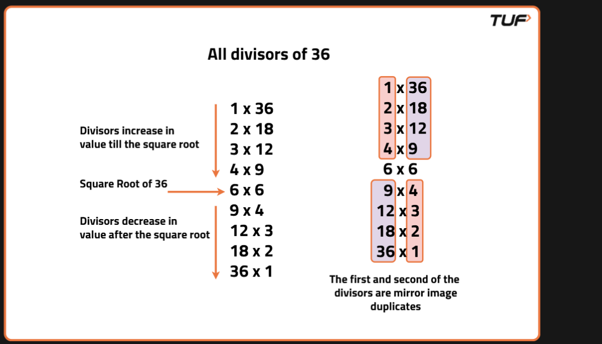

## Getting started 

**Install Compiler**

https://github.com/brechtsanders/winlibs_mingw/releases/

where.exe <application> Gets all paths of that application set in environmental variables 

https://chatgpt.com/c/6a705153-a7d4-83ee-90ec-15bb51d2c4df

https://chatgpt.com/c/6a705d49-d7c0-83e8-9b5b-1cad966acd50

https://chatgpt.com/c/6a706d54-d0d0-83ee-8c19-b7e538261649


https://chatgpt.com/c/6a70ce2a-2fe0-83e8-9d09-38bcd32e7bd3

https://chatgpt.com/c/6a70d18c-c544-83e8-a9c7-5ae067f08c87

## Passing, Returning, and Assigning Strings
Strings in C++ can be assigned and passed like primitive types. Assigning one string to another makes a deep copy of the character sequence:

In C++, strings can be seamlessly passed between functions. When you pass a string as an argument to a function, you're essentially making a copy of the string. Any changes made to the string within the function won't affect the original string outside of it.

Copying strings is not merely a superficial process, it involves creating a new string with an identical character sequence. Whether you're assigning a string to another or passing it to a function, you're essentially creating a fresh copy.

```
#include <bits/stdc++.h>
```

This contains all the standard libraries in C++. However, it's not recommended for production code due to potential issues with compilation time and namespace pollution. Instead, include only the specific headers you need.


String Comparison
The == known as the equality operator is used for comparing two values to check if they are equal. In programming, it's commonly used to compare variables, such as numbers or strings, to determine if they have the same value. For example, x == y will return true if x is equal to y, and false otherwise.
The != known as the inequality operator is used to check if two values are not equal. It's the opposite of the equality operator. If the values being compared are not equal, != returns true; if they are equal, it returns false. We can check if two strings are equal or not and at the same time we can also check whether particular characters of two strings are equal or not.

```c++
 bool compareStrings(string str1, string str2) {
        // Return true if strings are equal
        return str1 == str2;
    }
```

switch is for int and char and long basically all integral and foating point datatypes  in c++ 


```c++

#include <iostream>
using namespace std;

int main() {
    int n = 5;
    int factorial = 1;

    while (n > 0) {
        factorial *= n;  //Keep finding factorial with n and decrement n 
        n--;
    }

    cout << "Factorial of 5 is: " << factorial << endl;  //Print the factorial

    return 0;
}

```

While loops are particularly useful when you need to ensure that a block of code executes only when the condition is satisfied as it terminates as soon as that condition becomes false. This can be vital for tasks like validating user input or processing data until a specific condition is met. By checking the condition at the beginning of the loop, you can control whether the loop body is executed or not.

Java
Java is always pass-by-value, even for objects. But for objects, the value is a reference (confusing right?). So changes to object contents reflect.




