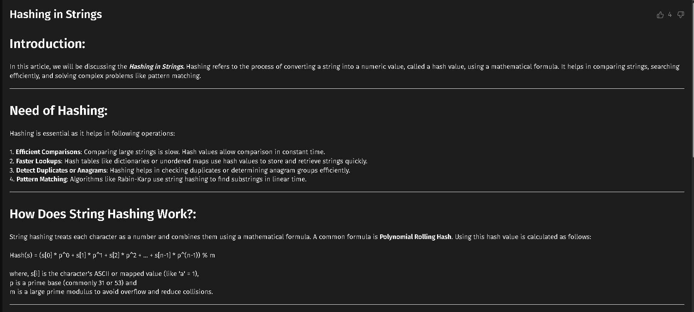
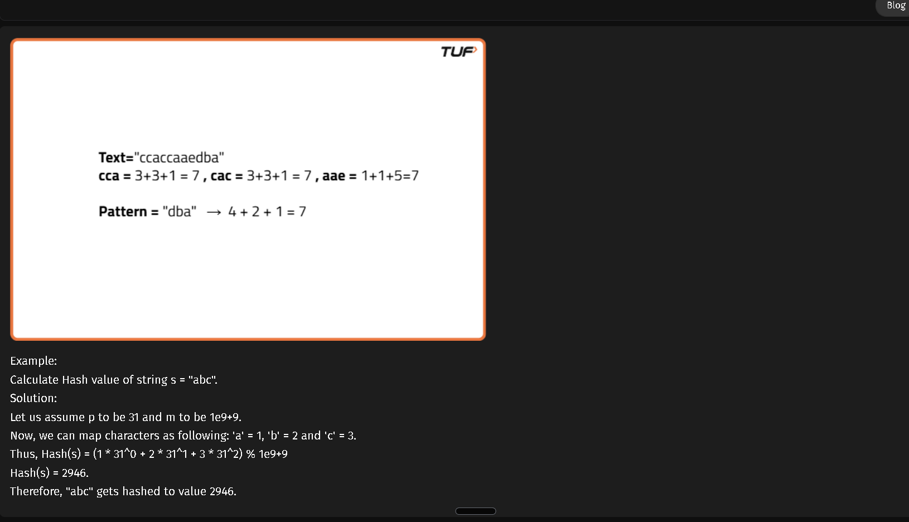
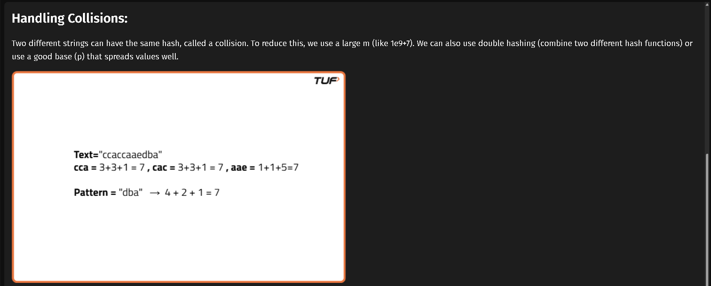
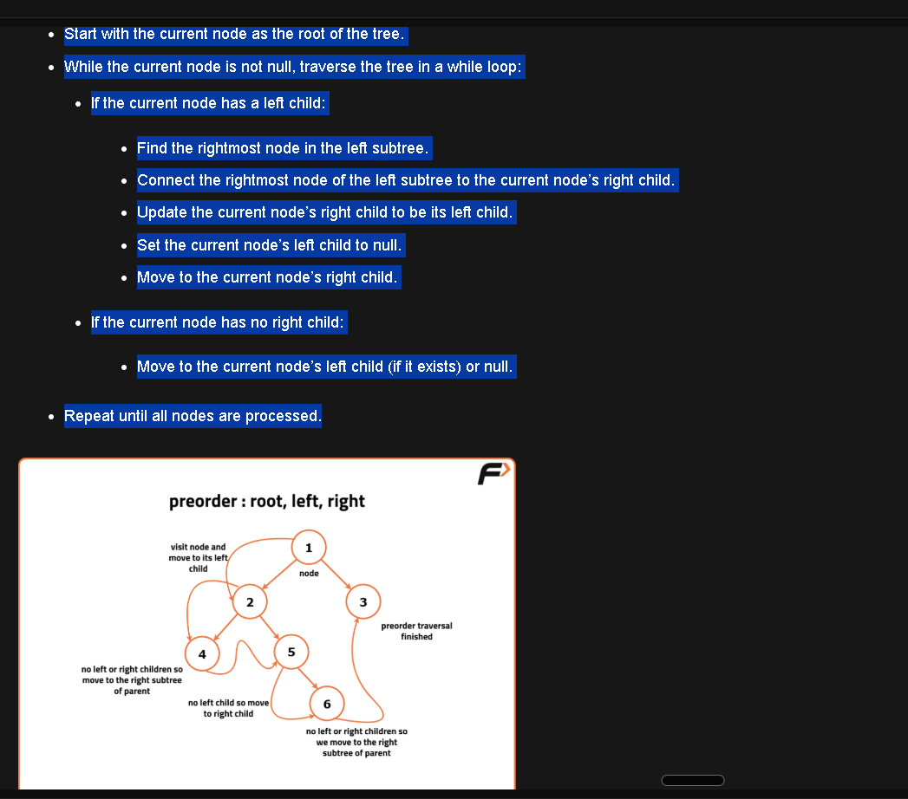

## Getting started 

**Install Compiler**

https://github.com/brechtsanders/winlibs_mingw/releases/

where.exe <application> Gets all paths of that application set in environmental variables 

https://chatgpt.com/c/6a705153-a7d4-83ee-90ec-15bb51d2c4df

https://chatgpt.com/c/6a705d49-d7c0-83e8-9b5b-1cad966acd50

https://chatgpt.com/c/6a706d54-d0d0-83ee-8c19-b7e538261649


https://chatgpt.com/c/6a70ce2a-2fe0-83e8-9d09-38bcd32e7bd3

https://chatgpt.com/c/6a70d18c-c544-83e8-a9c7-5ae067f08c87

## Passing, Returning, and Assigning Strings
Strings in C++ can be assigned and passed like primitive types. Assigning one string to another makes a deep copy of the character sequence:

In C++, strings can be seamlessly passed between functions. When you pass a string as an argument to a function, you're essentially making a copy of the string. Any changes made to the string within the function won't affect the original string outside of it.

Copying strings is not merely a superficial process, it involves creating a new string with an identical character sequence. Whether you're assigning a string to another or passing it to a function, you're essentially creating a fresh copy.

```
#include <bits/stdc++.h>
```

This contains all the standard libraries in C++. However, it's not recommended for production code due to potential issues with compilation time and namespace pollution. Instead, include only the specific headers you need.


String Comparison
The == known as the equality operator is used for comparing two values to check if they are equal. In programming, it's commonly used to compare variables, such as numbers or strings, to determine if they have the same value. For example, x == y will return true if x is equal to y, and false otherwise.
The != known as the inequality operator is used to check if two values are not equal. It's the opposite of the equality operator. If the values being compared are not equal, != returns true; if they are equal, it returns false. We can check if two strings are equal or not and at the same time we can also check whether particular characters of two strings are equal or not.

```c++
 bool compareStrings(string str1, string str2) {
        // Return true if strings are equal
        return str1 == str2;
    }
```

switch is for int and char and long basically all integral and foating point datatypes  in c++ 


```c++

#include <iostream>
using namespace std;

int main() {
    int n = 5;
    int factorial = 1;

    while (n > 0) {
        factorial *= n;  //Keep finding factorial with n and decrement n 
        n--;
    }

    cout << "Factorial of 5 is: " << factorial << endl;  //Print the factorial

    return 0;
}

```

While loops are particularly useful when you need to ensure that a block of code executes only when the condition is satisfied as it terminates as soon as that condition becomes false. This can be vital for tasks like validating user input or processing data until a specific condition is met. By checking the condition at the beginning of the loop, you can control whether the loop body is executed or not.

Java
Java is always pass-by-value, even for objects. But for objects, the value is a reference (confusing right?). So changes to object contents reflect.


Whenever accessing vector element via v[i] or v.back() or v.front() or v.at(i) make sure your vector is not empty i.e v.empty() returning true 

Rule to remember: Whenever you use .back(), .front(), or access v[0], make sure the vector isn't empty first. A common pattern is:

if (v.empty() || v.back() != x) {
    v.push_back(x);
}

This works because of short-circuit evaluation of ||. (only first conjdition true means done no mor e checking of condifiton


&& first condition false means doesnt check second cndition)


# string hashing









Ch-`0` concerts numbers in string to number as ascii of zero is 48co
nvert string numbers to number

ch + '0' converts number to string as ascii of zero is 48 convert number to string

ch + ' ' (converts uppercase to lowercase as ascii value is 32 take 

ch = 'A' 65 + 32 = 97 = 'a'  )

ch - ' ' (converts lowercase to uppercase as ascii value is 32 take a = 97 - 32 = 65 = 'A'  )   


https://chatgpt.com/share/6a8b5c4e-3f0c-83e9-9f56-d23c072dfb23?ogimg=plain

https://chatgpt.com/share/6a86b085-36ec-83ee-a829-037ccb512fbc?ogimg=plain

https://chatgpt.com/share/6a83e21f-d7e4-83e8-b02f-500cd3cc7d69?ogimg=plain

https://chatgpt.com/share/6a83e0a8-4150-83ee-9172-b705c00b7410?ogimg=plain

https://chatgpt.com/share/6a8382f5-04d0-83ee-8739-d5cac5dc0fb4?ogimg=plain

https://chatgpt.com/share/6a838104-7458-83e8-afb3-33f59f157af2?ogimg=plain

https://chatgpt.com/share/6a837dc9-9a90-83e8-9dfc-2f735bb68f23?ogimg=plain

https://chatgpt.com/share/6a83792b-bda8-83e8-b681-61c1a147619b?ogimg=plain

https://chatgpt.com/share/6a83676d-e2f0-83ee-bd62-dd8ac891411d?ogimg=plain

https://chatgpt.com/share/6a7b2fb6-1438-83e8-9981-8095dd7871ff?ogimg=plain



# C language 

# C Compilation Flow — C → Assembly → Object Code → Linker → Executable

When you write a C program, GCC goes through several stages to turn your C code into an executable program.

## Complete Flow

```text
C source code (.c)
       ↓
    Compiler
       ↓
Assembly code (.s)
       ↓
   Assembler
       ↓
Object file (.o)
       ↓
     Linker
       ↓
Executable (.exe)
```

---

## 1. C Source Code

You start with a C file:

```c
#include <stdio.h>

int main() {
    printf("Hello");
    return 0;
}
```

For example:

```text
main.c
```

---

## 2. Compiler

The **compiler** translates C code into assembly code.

```bash
gcc -S main.c -o main.s
```

This creates:

```text
main.s
```

The `.s` file contains assembly instructions for the target CPU.

You can view it with:

```bash
cat main.s
```

or:

```bash
code main.s
```

---

## 3. Assembler

The **assembler** converts assembly code into an object file containing machine code and other information needed for linking.

```bash
gcc -c main.s -o main.o
```

This creates:

```text
main.o
```

The object file is **not yet the final executable**.

---

## 4. Linker

The **linker** combines object files and libraries to create the final executable.

For example, your program uses:

```c
printf("Hello");
```

But the implementation of `printf()` is provided by a C library.

The linker connects your code with the required library code.

Conceptually:

```text
main.o ───────────────┐
                      │
other.o ──────────────┤
                      ↓
                   LINKER
                      ↓
              Libraries
                      ↓
                 main.exe
```

The linker also:

* Combines multiple `.o` object files
* Resolves references between functions and variables
* Connects your program with required libraries
* Produces the final executable

For example:

```text
main.o
math.o
utils.o
   │
   ↓
 Linker
   │
   ↓
program.exe
```

---

# Complete GCC Commands

You can perform each stage separately:

### C → Assembly

```bash
gcc -S main.c -o main.s
```

### Assembly → Object File

```bash
gcc -c main.s -o main.o
```

### Object File → Executable

```bash
gcc main.o -o main.exe
```

So:

```text
main.c
  ↓ gcc -S
main.s
  ↓ gcc -c
main.o
  ↓ gcc
main.exe
```

---

# GCC Can Do Everything Automatically

Normally, you simply write:

```bash
gcc main.c -o main.exe
```

GCC performs the necessary stages for you:

```text
main.c
  ↓
Compiler
  ↓
Assembly / machine-code generation
  ↓
Object file
  ↓
Linker
  ↓
main.exe
```

You don't normally need to manually create the `.s` and `.o` files.

---

# Important GCC Flags

| Flag | Purpose                                      |
| ---- | -------------------------------------------- |
| `-S` | Stop after compilation and generate assembly |
| `-c` | Generate an object file without linking      |
| `-o` | Specify the output filename                  |

Examples:

```bash
gcc -S main.c -o main.s
gcc -c main.s -o main.o
gcc main.o -o main.exe
```

---

# Simple Mental Model

Remember it like this:

```text
COMPILER
C → Assembly / low-level code

ASSEMBLER
Assembly → Object / machine code

LINKER
Object files + Libraries → Executable
```

### In one line:

```text
C → Compiler → Assembly → Assembler → Object Files → Linker → Executable
```

**Compiler translates.
Assembler converts assembly into object code.
Linker joins object files and libraries together.**

# GCC Compilation Commands

## Preprocessor

```bash
gcc -E main.c -o main.i
```

## View Preprocessor Output

```bash
cat main.i
```

```bash
less main.i
```

## Compiler → Assembly

```bash
gcc -S main.c -o main.s
```

## View Assembly

```bash
cat main.s
```

```bash
less main.s
```

```bash
code main.s
```

## Assembly → Object File

```bash
gcc -c main.s -o main.o
```

## C → Object File Directly

```bash
gcc -c main.c -o main.o
```

## Link Object File → Executable

```bash
gcc main.o -o main.exe
```

## Compile + Link Directly

```bash
gcc main.c -o main.exe
```

## Run Executable — Windows

```powershell
.\main.exe
```

## Run Executable — Linux/macOS

```bash
./main
```

## Compile Multiple C Files

```bash
gcc main.c math.c utils.c -o program.exe
```

## Link Multiple Object Files

```bash
gcc main.o math.o utils.o -o program.exe
```

## Complete Manual Flow

```bash
gcc -E main.c -o main.i
gcc -S main.i -o main.s
gcc -c main.s -o main.o
gcc main.o -o main.exe
```

## View All Generated Files

```bash
dir
```

Linux/macOS:

```bash
ls
```


## C language Design patterns and C++ Learning 

https://www.learncpp.com/

https://coddy.tech/landing/c?af_sub1=learn-c.org

https://learn-c.org/

https://coddy.tech/landing/c?af_sub1=learn-c.org

https://coddy.tech/learn/c/object_oriented_programming/destructor_pattern

https://chatgpt.com/uc/6aaae5e0-2aac-83ea-a7d1-c4a5e3001c1a

https://cppreference.com/

